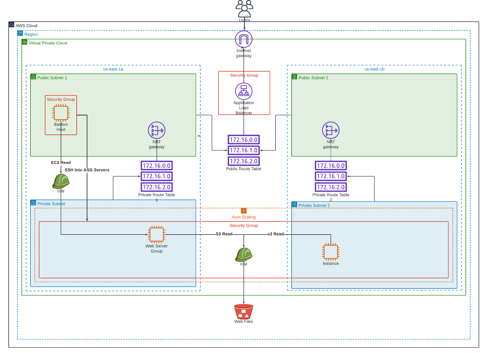

# Deploying a Highly Available Web App On EC2. <a id ='top'></a>

<br>
<br>

## Summary

Deploying a web app in an austosclaing group across two private subnets. Routing traffic to the serves throught an ALB. Pulling web-app files from s3 into EC2 with userdata scripts. Setting up Bastion Host to access private subnet servers.

<br>

## Tech Stack

- AWS VPC
- AWS EC2, ASG, ALB
- AWS CLI
- AWS S3
- AWS CLoud Formation
- AWS IAM
- Bash

<br>

## Architecture Diagram

<details>
<summary> Expand for Details</summary>
<br>



</details>

<br>
<br>
<br>

# Contents

- [Objective](#obj)
- [Steps](#steps)
- [Via Cloud Formation](#0)
- [Via Terraform](#1)
- [Via CLI/Bash Script](#2)
- [Via Console](#3)
- [Resources](#res)
- [To-Do](#to-do)
- [go to top](#top)

<br>
<br>

# Objective <a id='obj'></a> ([go to top](#top))

## Scenario

Your company is creating an Instagram clone called Udagram. Developers want to deploy a new application to the AWS infrastructure. You have been tasked with provisioning the required infrastructure and deploying a dummy application, along with the necessary supporting software.

This needs to be automated so that the infrastructure can be discarded as soon as the testing team finishes their tests and gathers their results.

## Objectives

- [x] You'll need to create a `Launch Configuration` for your application servers in order to deploy `four servers,` `two located in each of your private Subnets`. The launch configuration will be used by an auto-scaling group.
- [x] You'll need `two vCPUs and at least 4GB of RAM.`
- [x] The Operating System to be used is `Ubuntu 18`. So, choose an `Instance size and Machine Image (AMI) that best fits this spec`. Be sure to allocate `at least 10GB` of disk space so that you don't run into issues.
- [x] Since you will be `downloading the application archive from an S3 Bucket`, you'll need to create an `IAM Role that allows your instances to use the S3 Service.`
- [x] Udagram communicates on the default `HTTP Port: 80,` so your servers will need this inbound port open since you will use it with the Load Balancer and the Load Balancer Health Check. As for outbound, the servers will need unrestricted internet access to be able to download and update their software.
- [x] The `load balancer `should `allow all public traffic (0.0.0.0/0) on port 80 inbound`, which is the default HTTP port. Outbound, it will only be` using port 80 to reach the internal servers.`
- [x] The application needs to be `deployed into private Subnets` with a Load Balancer located in a public Subnet.
- [x] One of the `output` exports of the CloudFormation script should be `the public URL of the LoadBalancer`. Bonus points if you `add http:// in front of the load balancer DNS Name `in the output, for convenience.
- [x] Set up a `bastion host (jump box)` to allow you to `SSH into your private Subnet servers.` This bastion host would be on a `Public Subnet with port 22 `open only to your home IP address, and it would need to have the `private key` that you use to `access the other servers.`

<br>
<br>

# Steps <a id='steps'></a> ([go to top](#top))

<details>
  <summary> Expand For Details </summary>
  <br>
  
  - run
    ```
    aws configure
    ```
  - the region used here is `us-east-1`
  - `Create a Key Pair` named `asg-alb` and save the private key in the [keypair dir](./keypair)
  - `Obtain latest Ami id` of `Ubuntu 18`
  - `Obtain your IP Address`
    - Add values `Key Pair name`, `Ip Address` and `ami Id` to [parameters.json ](./cloudformation/parameters.json)
    - Parameter Keys: `asgKeyPair`, `sshIp` and `asgImageId`
  - deploy [cloudformation template](./cloudformation/main.yaml) which creates the following resources
    - a `VPC`
    - an `Internet Gateway (IGW)`
    - an `Internet Gateway attachment` to link the `VPC` to the `IGW`
    - `2 Public Subnets`, `1 Public Route Table`, `1 Public Route`, `2 Public Route Table association`s for `each Subnet`
    - `2 Nat Gateways` each with their own `Elactic IP addresses`
    - `2 Private Subnets`, `2 Private Route Tables`, `Routes` and `Route Table Associations`
    - `1 Security Group` for the `Load Balancer (ALB)`, allowing `HTTP Ingress` and `Egress`
    - `1 Security Group` for the `Auto Scaling Group (ASG)` allowing `HTTP Ingress` and `SSH Ingress`
    - `1 Security Group` for the `Bastion Host` allowing `SSH Ingress` from `your IP`
    - `2 IAM Roles` with `s3ReadAccess` and `ec2ReadOnlyAccess` for the `ASG Launch Config` and the `Bastion Host`
    - `1 Bastion Host`
    - `1 ASG Launch Config` , `1 ASG`, `1 ASG Scaling Policy` for `CPU Utilisation`
    - `1 ALB Target Group`, `1 ALB`, `1 ALb Listener`, `1 ALB Listener Rule`
</details>

<br>
<br>
<br>

# Via Cloud Formation <a id='0'></a> ([go to top](#top))

<details>
<summary> Expand For Details </summary>

- Clone this repo and navigate to it.

- Run the script to deploy the template

  ```
  ./scripts/run.sh create-stack
  ```

- After 7 minutes, the script will automatically print ALB Domain to stdout

  ```bash
  # example
  -------- alb-dns: http://asg-a-publi-8Q9RIHMEQFPX-999194011.us-east-1.elb.amazonaws.com
  ```

- Then script will also automatically copy revelant files and ssh into bastion Host. Enter yes to the prompt

  ```
  Are you sure you want to continue connecting (yes/no/[fingerprint])? yes
  ```

- Once in bastion host run the block below to output the `Private IPs` of all running instances to file `instance-details.txt`

  ```
  bash ./instance-details.sh
  ```

- Obtain `Private IP` addressed of ASG server

  - private instances are in IP range `10.0.2.x` and `10.0.3.x` as defined in the template

  ```
  cat instance-details.txt
  ```

- ssh into any private instance

  ```bash
  ssh -i asg-alb.cer ubuntu@10.0.2.x
  #or
  ssh -i asg-alb.cer ubuntu@10.0.3.x
  ```

</details>

<br>
<br>
<br>

# Via Terraform <a id='1'></a> ([go to top](#top))

<details>
<summary> Coming Soon </summary>

</details>

<br>
<br>
<br>

# Via CLI/Bash Script<a id='2'></a> ([go to top](#top))

<details>
<summary> Coming Soon </summary>

</details>

<br>
<br>
<br>

# Via Console <a id='3'></a> ([go to top](#top))

<details>
<summary> Coming Soon </summary>

</details>

<br>
<br>
<br>

# Resources <a id='res'></a> ([go to top](#top))

<details>
  <summary> Expand For Details  </summary>
    - simulate stress on ASG
    
    - https://docs.aws.amazon.com/AWSEC2/latest/UserGuide/finding-an-ami.html#finding-an-ami-console
    
    - https://docs.aws.amazon.com/AWSCloudFormation/latest/UserGuide/aws-resource-ec2-internetgateway.html#cfn-ec2-internetgateway-tags
    - https://docs.aws.amazon.com/AWSCloudFormation/latest/UserGuide/aws-resource-iam-role.html#cfn-iam-role-path
    - https://docs.aws.amazon.com/AWSCloudFormation/latest/UserGuide/aws-resource-iam-instanceprofile.html
    - https://docs.aws.amazon.com/IAM/latest/UserGuide/id_roles_use_switch-role-ec2_instance-profiles.html
      ¡
    - https://docs.aws.amazon.com/AWSCloudFormation/latest/UserGuide/pseudo-parameter-reference.html
    
    - https://docs.aws.amazon.com/AWSCloudFormation/latest/UserGuide/aws-resource-autoscaling-launchconfiguration.html
    
    - https://docs.aws.amazon.com/AWSEC2/latest/UserGuide/device_naming.html
    
    - https://docs.aws.amazon.com/AWSCloudFormation/latest/UserGuide/aws-attribute-creationpolicy.html
    
    - https://docs.aws.amazon.com/AWSCloudFormation/latest/UserGuide/quickref-autoscaling.html
    
    - https://docs.aws.amazon.com/AWSCloudFormation/latest/UserGuide/aws-attribute-updatepolicy.html

</details>

<br>
<br>
<br>

# To-Do <a id='to-do'></a> ([go to top](#top))

<details>
  <summary> Expand For Details </summary>
  <br>
  - same project but make it serverless!
  - add stress test to test scaling policies
  - add Network ACLs
  - make keypair name a viariable
  - fix ALB Request Scaling Policy
  - Add CFN helper cripts to send success signals to ASG Creation policy
  - upgrade python on ubuntu 18 (or just use ubuntu 20?)
</details>
